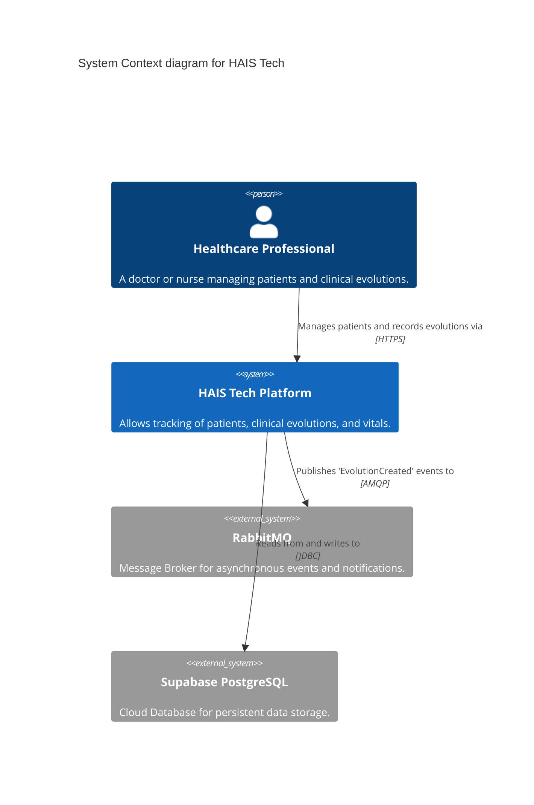
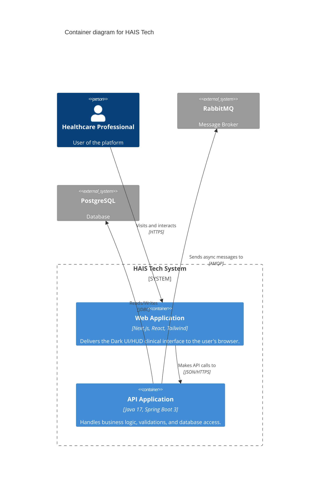
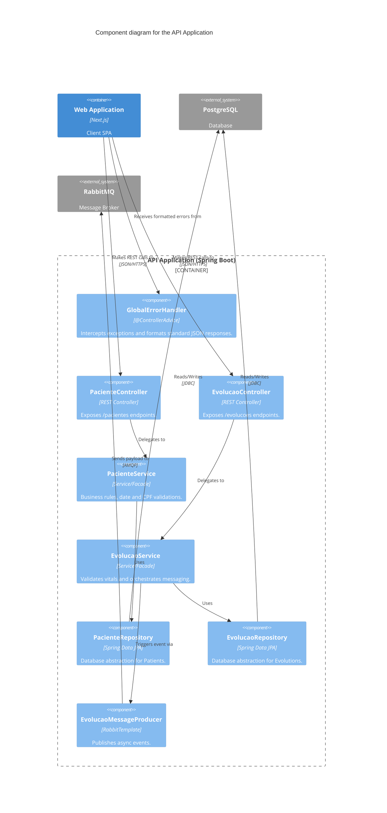

# 🏗️ HAIS Tech - C4 Model Architecture

This document describes the software architecture of the HAIS Tech Clinical platform using the [C4 Model](https://c4model.com/). Diagrams are generated using Mermaid.js.

## 1. System Context Diagram (Level 1)
Shows the macro view of the system and its interactions with external actors.

---

## 2. Container Diagram (Level 2)
Shows the high-level technical architecture and how responsibilities are distributed.

---

## 3. Component Diagram (Level 3 - API Application)
Shows the internal structure of the Spring Boot Application and the applied Design Patterns.

